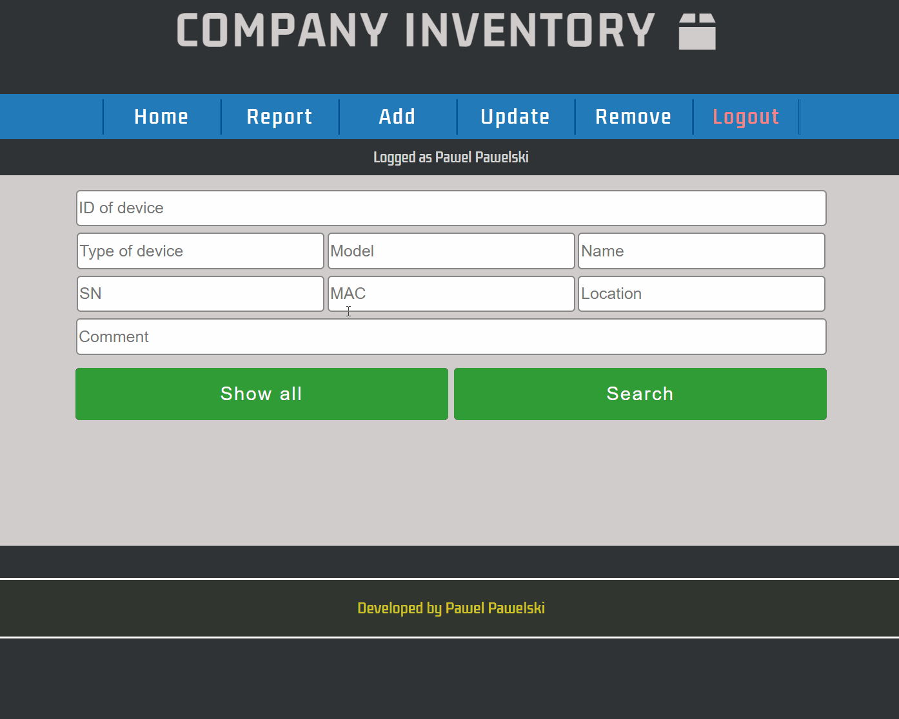
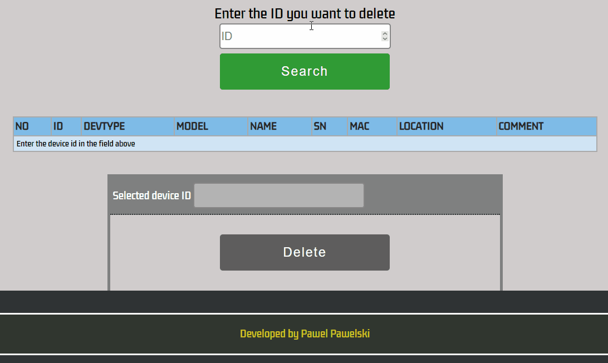

# Inventory
Basic program for hardware inventory. Using it you can add equipment, update records, delete equipment, and display the balance, for example, for a given department

  

# Background
Looking to grow as a programmer, I created this application to transfer our list of equipment from Excel and at the same time to learn how to better work with the database. Since at work we have a lot of handheld scanners, which are difficult to control, this application was created mainly with them in mind, but it can be successfully used to list any type of equipment

# Technologies used
Dedicated server with XAMPP installed (MySQL, PHP)

# Features
- after 15 min of inactivity there is automatic logout
- password is hashed in the database
- sweetalert2 instead of standard alerts  
https://sweetalert2.github.io
- when you are adding a new device, you have to scan a barcode as well and stick it on the device so you can quickly find it in the application (see below)
- if the displayed list is long, there is an "up" button, which can be used to quickly scroll to the top of the page
- in the event of deletion of equipment, this equipment is not removed from the database, but its status changes to removed so you can restore accidentally deleted hardware or review the entire history
- you can sort the table on report view and edit equipment from there (see below)

# How to use
To use this app you need to install XAMPP and modify the connect.php file properly. Then you need to create two tables: "users" (create logins and passwords) and "inventory_table" to store data

# Screenshots
**Login page**  
  
**Report**  
  
**Add**  
  
**Update**  
  
**Delete**  
  